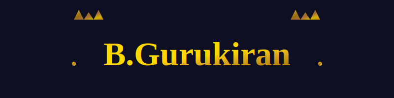

  <!-- Animated Name Header -->
  

  

<h1 align="center">Software Developer | Technology Enthusiast | Problem Solver</h1>

  <em>Passionate about creating innovative solutions through code and driving technological advancement</em>

---

## 👨‍💻 About Me

- 🎓 **Undergraduate Student** specializing in Computer Science and Software Development
- 🔭 **Currently Working On:** Health monitoring applications and IoT automation systems
- 🌱 **Learning:** Advanced data structures, algorithms, and modern web technologies
- 💡 **Interests:** Full-stack development, automation technologies, and system design
- 🎯 **Career Goal:** To become a skilled software engineer contributing to impactful technology solutions
- 📫 **Reach me at:** [Your Email Address]

---

## 🛠️ Technical Skills

### **Programming Languages**

  

### **Frameworks & Technologies**

  

### **Tools & Platforms**

  

---

## 💼 Professional Experience

- **Project Development:** Health monitoring applications with real-time data processing
- **IoT Development:** Sensor programming and automation system design
- **Technical Training:** Actively pursuing industry certifications and skill enhancement programs
- **Open Source:** Contributing to community projects and maintaining personal repositories

---

## 🎯 Current Focus

- Building scalable web applications with modern technologies
- Exploring machine learning and data analysis tools
- Developing proficiency in cloud platforms and DevOps practices
- Preparing for software engineering roles and technical interviews

---

## 🌐 Professional Networks

  &nbsp;&nbsp;
  &nbsp;&nbsp;
  &nbsp;&nbsp;
  &nbsp;&nbsp;
  

---

## 📊 GitHub Analytics

  
  
  
  
  

  

---

## 🏆 Achievements & Recognition

- 🎯 Active contributor to open-source projects
- 📚 Continuous learner with focus on emerging technologies
- 🤝 Collaborative team player with strong problem-solving skills
- 💻 Proficient in multiple programming paradigms and development methodologies

---

  <h3>💡 "Code is poetry written in logic" 💡</h3>
  
<em>Let's connect and build innovative solutions together!</em>

  
  

